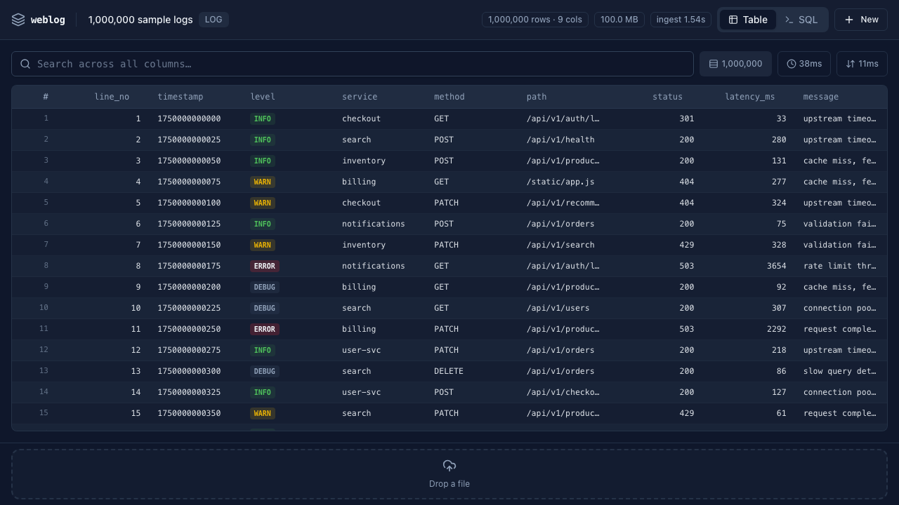

# weblog

A serverless, 100% client-side tool that loads **a million log lines** (or CSV / XLSX)
into an in-browser [DuckDB-Wasm](https://github.com/duckdb/duckdb-wasm) and lets you
sort, search, and query them at interactive speed. Your data never leaves the browser.



## What it does

- **Big-data in a static page.** DuckDB-Wasm is a real columnar SQL engine running in
  the tab. A million rows ingest in ~1.5s and aggregate in single-digit milliseconds.
- **Any tabular source.** Logs (`.log` / `.txt`), `.csv` / `.tsv`, and `.xlsx`. Log files
  get timestamp + level extraction; XLSX is flattened with SheetJS.
- **Off-thread parsing.** CSV/XLSX/log parsing and the 1M-row sample generator run in
  Web Workers, so the UI never janks.
- **Windowed virtual scroll.** Only the visible rows are rendered and only the needed
  row windows are fetched from DuckDB (LRU page cache, capped at 10,000 rows in memory).
  Scroll a million rows like it's a hundred.
- **Instant search & sort.** Case-insensitive search across every column; click any header
  to sort. Every query shows its real elapsed time.
- **SQL REPL.** Drop into raw SQL against your data (`⌘/Ctrl + Enter` to run).
- **OPFS persistence.** Datasets are stored in the Origin Private File System and survive
  reloads.

## Architecture

```
File ─▶ parse.worker (CSV/XLSX/log → normalized CSV bytes)
            │
            ▼
       DuckDB-Wasm worker  ◀── OPFS (opfs://weblog.db)
            │
   ┌────────┴─────────┐
   ▼                  ▼
VirtualTable       SQL REPL
(windowed fetch)   (runSql)
```

| Concern | Implementation |
| --- | --- |
| Query engine | `@duckdb/duckdb-wasm` (its own worker) |
| Parsing | `src/workers/parse.worker.ts` (SheetJS for XLSX, regex for logs) |
| Sample data | `src/workers/sample.worker.ts` (1M synthetic rows) |
| Windowed rows | `src/hooks/useWindowedRows.ts` (LRU page cache) |
| Virtual scroll | `@tanstack/react-virtual` |
| UI | React 19, Tailwind v4, shadcn/ui primitives, lucide icons, slate theme |

## Develop

```bash
npm install
npm run dev      # http://localhost:5173
npm run build    # type-check + production build
```

> The dev server sets `Cross-Origin-Opener-Policy` / `Cross-Origin-Embedder-Policy`
> so DuckDB-Wasm can use its threaded (SharedArrayBuffer) build. Any static host that
> sends those headers will serve the production build.

## Try it

Open the landing page and click **Load 1,000,000 sample logs** — it generates a million
synthetic web-server log rows and opens them in the tool, no file required. Or drop in
your own `.log`, `.csv`, or `.xlsx`.
